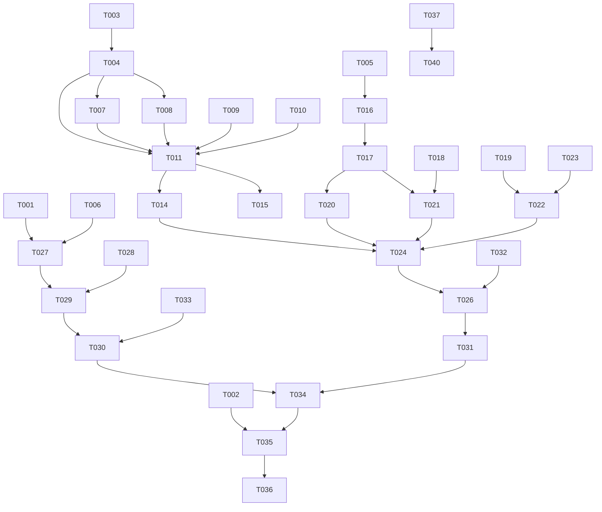

# Tasks: IELTS 雅思背单词系统

**Input**: Design documents from `spec/vocab-system/`
**Prerequisites**: plan.md (required), spec.md (required for user stories)

**Tests**: 未在规格中明确要求，不生成测试任务。

**Organization**: 任务按用户故事分组，每个故事可独立实现和测试。

## Format: `[ID] [P?] [Story] Description`

- **[P]**: 可并行执行（不同文件，无依赖）
- **[Story]**: 任务所属用户故事（US1, US2, US3, US4）
- 描述中包含具体文件路径

## Phase 1: Setup (Shared Infrastructure)

**Purpose**: 新增文件创建和基础结构搭建

- [X] T001 创建AI词汇分析提示词模板文件 assets/prompts/vocab-analysis.md，包含模板变量({{analysisScope}}, {{totalWords}}, {{candidateWords}}等)和JSON输出Schema定义
- [X] T002 创建词汇AI分析报告独立窗口页面 assets/generated/reading-exams/vocab-ai-report.html，从IndexedDB(ielts_vocab_analysis)读取analysisId对应数据并渲染完整报告(综合评估/错误分布/薄弱类别/逐词分析/学习计划/建议)
- [X] T003 [P] 在index.html主导航栏(wrongbook按钮后)新增「单词」导航按钮 data-view="vocab" 标签"📖 单词"，并在index.html中将现有 section#vocab-view 改造为三合一容器：移除hidden属性，内部添加子标签栏(记忆/测试/AI分析)和三个子容器div(vocab-memory-panel/vocab-quiz-panel/vocab-analysis-panel)，替换原有 vocab-view-shell

---

## Phase 2: Foundational (Blocking Prerequisites)

**Purpose**: 核心基础设施，所有用户故事的前置依赖

**⚠️ CRITICAL**: 用户故事工作不可在本阶段完成前开始

- [X] T004 在more.bundle.js中创建VocabMainView模块(IIFE)，实现mount(containerSelector)方法构建三合一布局DOM：子标签栏(记忆/测试/AI分析) + 三个子容器，switchSubView(subViewId)方法切换子视图显示/隐藏，注册到window.VocabMainView
- [X] T005 在more.bundle.js中创建VocabQuizModule存储层：打开IndexedDB ielts_vocab_quiz(DB_VERSION=1)，包含quiz_sessions(keyPath:sessionId, index:analyzedAt)、quiz_questions(keyPath:questionId, index:sessionId)、synonym_cache(keyPath:word)三个objectStore，实现ensureDB()懒初始化模式
- [X] T006 [P] 在practice.bundle.js中创建VocabAIModule存储层：打开IndexedDB ielts_vocab_analysis(DB_VERSION=1)，包含vocab_analysis_results(keyPath:analysisId, index:analyzedAt)，实现ensureDB()懒初始化模式，与WrongbookAI共享API_URL/API_KEY/MODEL常量
- [X] T007 修改legacy-app.bundle.js的showView()函数，增加vocab分支：当normalized==='vocab'时调用VocabMainView.mount('#vocab-view')和VocabMainView.refresh()，处理VocabMainView未就绪的重试(同wrongbook的setInterval重试模式)
- [X] T008 修改legacy-app.bundle.js的navigateToView()的navMap和viewMap，增加vocab映射('vocab': '[data-view="vocab"]'和'vocab': '#vocab-view')；修改onViewActivated()增加case 'vocab'调用VocabMainView.refresh()
- [X] T009 修改more.bundle.js的handleVocabEntry()函数，将VocabSessionView.mount('#vocab-view')改为调用VocabMainView.mount('#vocab-view')后switchSubView('memory')，并调用VocabSessionView.mount()指向VocabMainView内的记忆子容器
- [X] T010 [P] 在css/main.css中新增VocabMainView样式：子标签栏(.vocab-sub-tabs)样式、三个子容器(.vocab-memory-panel/.vocab-quiz-panel/.vocab-analysis-panel)基础布局、子标签active状态切换，复用现有wrongbook/shui设计语言

**Checkpoint**: 基础设施就绪 - 可点击「单词」标签页看到三合一布局，子标签可切换

---

## Phase 3: User Story 1 - 每日单词记忆复习 (Priority: P1) 🎯 MVP

**Goal**: 用户可在「单词」标签页的记忆子视图中使用SM-2间隔重复进行单词记忆复习

**Independent Test**: 切换到「单词」标签→记忆子视图→开始复习→完成若干单词评级→验证复习间隔正确更新→刷新页面验证进度持久化

### Implementation for User Story 1

- [X] T011 [US1] 修改VocabMainView.mount()，在记忆子容器(vocab-memory-panel)中创建VocabSessionView挂载点div(vocab-memory-root)，调用VocabSessionView.mount()指向该div，保留原有全部闪卡功能(卡片翻转/easy-good-hard评级/SM-2调度/词表切换)
- [X] T012 [US1] 修改VocabMainView.refresh()方法，当activeSubView==='memory'时调用VocabSessionView的刷新方法重新加载到期词和新词
- [X] T013 [US1] 在VocabMainView的子标签切换逻辑中，切换到memory时自动触发VocabSessionView的刷新；从其他子视图切回memory时重新计算到期词数量并更新子标签badge
- [X] T014 [US1] 验证记忆模块与VocabStore/VocabScheduler的完整集成：词表切换(IELTS核心/阅读高亮词/拼写错误词/自定义)、新词加载按频率降序、到期词优先、评级后EF/interval/nextReview正确更新并持久化
- [X] T015 [US1] 在css/main.css中调整VocabSessionView在新容器中的样式适配：确保vocab-memory-panel内的闪卡、进度条、设置菜单等正常显示，处理与子标签栏的间距

**Checkpoint**: 记忆模块完全可用，SM-2复习正常工作，词表可切换，进度持久化

---

## Phase 4: User Story 2 - 多题型单词测试 (Priority: P2)

**Goal**: 用户可在测试子视图中选择测试范围和题型组合，完成测试并查看结果，错词自动收录

**Independent Test**: 切换到测试子视图→选择范围和题型→完成一轮测试→查看逐题回顾和统计→验证错词出现在记忆模块复习队列

### Implementation for User Story 2

- [X] T016 [US2] 在more.bundle.js的VocabQuizModule中实现createSession(scope, questionTypes, options)方法：根据scope从VocabStore获取目标词列表，按题型比例分配题目数量，为每词生成对应题型的QuizQuestion(选项从同词表其他词的释义中随机抽取)，将QuizSession和QuizQuestion写入IndexedDB，返回session对象
- [X] T017 [US2] 在VocabQuizModule中实现5种题型的题目生成器：generateEn2CnQuestion(word, allWords)生成英文+4个中文选项、generateCn2EnQuestion(word, allWords)生成中文+4个英文选项、generateSpellingQuestion(word)生成释义+填空、generateContextFillQuestion(word)生成例句挖空+填空、generateSynonymQuestionStub(word)生成占位(待AI填充)
- [X] T018 [US2] 在VocabQuizModule中实现submitAnswer(sessionId, questionId, userAnswer, timeSpent)方法：判断isCorrect(拼写题支持近似正确判断)，更新QuizQuestion记录，返回更新后的question对象
- [X] T019 [US2] 在VocabQuizModule中实现completeSession(sessionId)方法：汇总correctCount/incorrectCount/score/duration，更新QuizSession，将错误单词调用VocabScheduler.scheduleAfterResult(word,'wrong')重置复习进度并增加'quiz-error'标签，返回{session, results, errorWords}
- [X] T020 [US2] 在VocabQuizModule中实现renderQuizSetup(containerEl)方法：渲染测试配置界面(范围选择：全部/到期/特定词表、题型勾选：5种题型checkbox、题目数量滑块：10-50、开始测试按钮)，从VocabStore获取词表列表填充下拉框
- [X] T021 [US2] 在VocabQuizModule中实现renderQuizSession(containerEl, sessionId)方法：渲染测试进行中界面(题号进度、题目内容、选项/输入框、提交按钮、计时器)，处理答题交互和submitAnswer调用
- [X] T022 [US2] 在VocabQuizModule中实现renderQuizResult(containerEl, sessionId)方法：渲染测试结果界面(总得分/正确率/用时统计、逐题回顾列表含正确答案和用户答案对比、错词高亮、返回/重做按钮)
- [X] T023 [US2] 在VocabQuizModule中实现getSessionHistory(limit)和getSessionQuestions(sessionId)方法：从IndexedDB读取历史测试会话和题目详情，用于结果回顾和历史查看
- [X] T024 [US2] 在VocabMainView中集成测试子视图：switchSubView('quiz')时在vocab-quiz-panel内调用renderQuizSetup()，测试开始后调用renderQuizSession()，测试完成后调用renderQuizResult()，完成后的错词反馈触发记忆子视图badge更新
- [X] T025 [US2] 在css/main.css中新增测试模块样式：测试配置表单(.quiz-setup)、答题界面(.quiz-session: 题目卡片/选项按钮/输入框/进度条)、结果界面(.quiz-result: 得分统计/逐题回顾/错词标记)，复用现有卡片和按钮设计语言
- [X] T026 [US2] 处理同义辨析题占位逻辑：当测试包含synonym题型时，先将这些题标记为pending，在测试开始前调用VocabAIModule.generateSynonymQuestions()批量预生成(如AI不可用则降级为en2cn题型并提示)

**Checkpoint**: 测试模块完全可用，5种题型可测试，结果可查看，错词自动反馈到记忆模块

---

## Phase 5: User Story 3 - AI单词分析与定制测试卷 (Priority: P3)

**Goal**: 用户可在AI分析子视图中触发本地预筛+AI精排分析，查看独立窗口报告，生成定制测试卷

**Independent Test**: 积累学习数据后→切换到AI分析子视图→点击分析→新窗口展示报告→点击生成定制测试卷→完成定制测试→结果反馈回记忆模块

### Implementation for User Story 3

- [X] T027 [US3] 在practice.bundle.js的VocabAIModule中实现loadPrompt()方法：fetch('assets/prompts/vocab-analysis.md')加载外部模板，失败时使用BUILTIN_PROMPT内置fallback(包含完整的词汇分析提示词和JSON Schema)，结果缓存到_promptTemplate变量
- [X] T028 [US3] 在VocabAIModule中实现prefilterCandidates(scopeKey)方法：从VocabStore获取词表数据，计算每词的errorRate(incorrectCount/(correctCount+incorrectCount))、reviewCount(repetitions)、freq等级、tags标签；筛选满足条件的词(errorRate>0.3或reviewCount>5或freq>=0.8或tags含quiz-error/spelling-error/highlight)，返回{words, stats}对象含统计摘要
- [X] T029 [US3] 在VocabAIModule中实现buildPrompt(group, scopeKey)方法：将预筛候选词和统计数据填入提示词模板的{{placeholder}}变量，生成完整的AI请求提示词；含candidateWords格式化(每词含word/meaning/errorCount/reviewCount/freq/tags)、quizHistory(近5次测试摘要)、weakCategories统计
- [X] T030 [US3] 在VocabAIModule中实现analyze(scopeKey, forceNew)方法：检查_pendingAnalyses去重(同WrongbookAI模式)；调用prefilterCandidates获取候选词；若候选词<5则拒绝分析并提示数据不足；调用loadPrompt+buildPrompt构造请求；POST到/api/proxy/v1/chat/completions；解析响应(parseAIResponse复用fence剥离逻辑)；调用saveResult持久化到IndexedDB；返回VocabAnalysisResult
- [X] T031 [US3] 在VocabAIModule中实现generateCustomPaper(analysisId, options)方法：从getResult获取分析结果；从parsed.wordAnalyses按priority和difficulty排序挑选20-50词；按题型比例分配(en2cn 30%/cn2en 20%/spelling 20%/context-fill 15%/synonym 15%)；对synonym题型调用generateSynonymQuestions预生成；调用VocabQuizModule.createSession创建测试会话；返回CustomTestPaper
- [X] T032 [US3] 在VocabAIModule中实现generateSynonymQuestions(words, count)方法：构造同义辨析生成提示词(给定目标词，要求AI生成包含正确词和3个近义干扰词的选择题+辨析解释)；批量调用API(每批10-15词)；解析响应并缓存到IndexedDB synonym_cache store；返回SynonymCache数组
- [X] T033 [US3] 在VocabAIModule中实现getResult/ saveResult/ isPending/ forceNew方法：与WrongbookAI模式完全一致，从ielts_vocab_analysis DB读写、_pendingAnalyses去重管理、_analysisCache内存缓存
- [X] T034 [US3] 在more.bundle.js中实现VocabMainView的AI分析子视图渲染：renderAnalysisPanel(container)方法渲染分析配置界面(分析范围选择：全部/特定词表、分析按钮、历史分析列表)；调用VocabAI.analyze后通过window.open('assets/generated/reading-exams/vocab-ai-report.html?analysisId=xxx')在独立窗口展示报告；"生成定制测试卷"按钮调用VocabAI.generateCustomPaper后切换到测试子视图开始定制测试
- [X] T035 [US3] 修改assets/generated/reading-exams/vocab-ai-report.html的IndexedDB读取逻辑，确保与VocabAIModule的ielts_vocab_analysis DB兼容(同DB名/版本/store名/keyPath)；渲染词汇分析报告全部section(summary/patternAnalysis/wordAnalyses/weakPoints/studyPlan/suggestions)；增加"生成定制测试卷"按钮(通过postMessage或window.opener调用VocabAI.generateCustomPaper)
- [X] T036 [US3] 在css/main.css中新增AI分析子视图样式：分析配置面板(.vocab-analysis-panel: 范围选择/分析按钮/历史列表)、分析状态提示(loading/success/error)；在vocab-ai-report.html中新增词汇分析专用样式(错误类型分布图/mastery分布/逐词卡片/薄弱类别诊断)

**Checkpoint**: AI分析完全可用，报告在独立窗口展示，定制测试卷可生成和完成

---

## Phase 6: User Story 4 - 单词数据管理与跨模块联动 (Priority: P4)

**Goal**: 词表可管理(统计/导入导出)，阅读高亮词和拼写错误自动同步

**Independent Test**: 在阅读练习中高亮生词→返回单词页查看高亮词表→导入导出词表→验证数据完整

### Implementation for User Story 4

- [X] T037 [US4] 在VocabMainView中增加词表管理入口：在记忆子视图的菜单中增加"词表管理"选项，弹出词表管理面板显示各词表统计(totalWords/masteredWords/reviewingWords/newWords)，支持导入(复用现有VocabDataIO)和导出(JSON下载)
- [X] T038 [US4] 验证阅读高亮生词自动同步：确保阅读练习中的高亮生词通过现有saveReadingHighlightVocab()保存到vocab_list_reading_highlights，VocabStore.loadList('reading-highlights')可正确加载，记忆模块可切换到该词表复习
- [X] T039 [US4] 验证拼写错误自动收录：确保SpellingErrorCollector将错误词保存到spelling-errors-p1/p4/master列表，VocabStore.loadList()可正确加载，记忆模块可切换到拼写错误词表复习
- [X] T040 [US4] 在测试子视图中增加"自定义范围"选项：用户可从任意词表勾选单词组成自定义测试范围，将选中的wordIds传入VocabQuizModule.createSession({wordIds: [...]})

**Checkpoint**: 数据管理完整，跨模块联动正常

---

## Phase 7: Polish & Cross-Cutting Concerns

**Purpose**: 跨故事的改进和优化

- [X] T041 在VocabMainView子标签栏显示实时badge：记忆子标签显示到期词数量、测试子标签显示最近未完成测试(如有)、AI分析子标签显示"新"标记(有新分析结果时)
- [X] T042 在VocabQuizModule中增加离线检测：AI相关功能(同义辨析/定制测试卷)在离线时显示提示并禁用，本地题型(en2cn/cn2en/spelling/context-fill)离线完全可用
- [X] T043 [P] 为vocab-ai-report.html增加暗色主题支持：复用main.css中bloom-dark-mode的CSS变量和配色方案
- [X] T044 在VocabMainView首次加载时(无学习记录)显示引导提示：推荐从IELTS核心词表开始、每日新词建议数量、子视图功能说明
- [X] T045 性能优化：词表加载时对大词表(IELTS核心3610词)实现分页/虚拟滚动，避免一次性渲染大量DOM

---

## Phase 8: Verification

<!-- verification_scope: build+ui -->

**Purpose**: 构建、部署和UI验证

- [X] T046 启动Node.js本地服务器(执行启动服务器.bat)，在浏览器中访问localhost:8080验证页面正常加载无JS错误
- [X] T047 验证「单词」标签页UI：点击导航栏"单词"按钮→标签页正确显示三合一布局→子标签(记忆/测试/AI分析)可切换→记忆子视图闪卡功能正常→测试子视图配置和答题功能正常→AI分析子视图配置和触发功能正常
- [X] T048 验证记忆模块端到端流程：开始复习→评级easy/good/hard→刷新页面→验证复习间隔和进度持久化→切换词表→验证词表数据正确加载
- [X] T049 验证测试模块端到端流程：选择英→中题型+到期词范围→完成测试→查看逐题回顾和统计→验证错词在记忆模块下次复习中出现
- [X] T050 验证AI分析端到端流程：确保有足够学习数据→点击AI分析→新窗口打开报告页面→报告包含所有section→点击生成定制测试卷→切换到测试视图完成定制测试

---

## 📊 Dependency Graph

## ⚡ Parallel Execution Guide

| Phase | Tasks | Required Files | Execution Notes |
|-------|-------|----------------|-----------------|
| Setup | T001, T002, T003 | 3个独立文件 | T001/T002可并行，T003依赖index.html但独立 |
| Foundational | T005, T006, T010 | 3个不同bundle/css文件 | T005/T006/T010可并行(不同文件) |
| Foundational | T004, T007, T008, T009 | 4个bundle修改 | T004先完成，T007/T008/T009可并行 |
| US1 | T011-T015 | more.bundle.js, main.css | 顺序执行，T014/T015可并行 |
| US2 | T016-T026 | more.bundle.js, main.css | T016-T019顺序，T020-T023可并行，T024-T026顺序 |
| US3 | T027-T036 | practice.bundle.js, more.bundle.js, vocab-ai-report.html, main.css | T027/T028可并行，T029-T033顺序，T034-T036顺序 |
| US4 | T037-T040 | more.bundle.js | T037-T040可并行 |
| Polish | T041-T045 | 多文件 | T043独立可并行，其余顺序 |

## Path Conventions

- **项目根目录**: `E:\雅思学习\`
- **Bundle文件**: `js/bundles/*.bundle.js` — 所有JS代码在此目录的手写IIFE模块中
- **CSS**: `css/main.css` — 单文件全局样式
- **HTML**: `index.html` — 单页应用主文件
- **新增资源**: `assets/prompts/` (提示词)、`assets/generated/reading-exams/` (独立窗口页面)
- **不创建新bundle文件** — 所有新代码内联到现有bundle中

## Dependencies & Execution Order

### Phase Dependencies

- **Setup (Phase 1)**: 无依赖 — 可立即开始
- **Foundational (Phase 2)**: 依赖Setup完成 — 阻塞所有用户故事
- **User Stories (Phase 3-6)**: 全部依赖Foundational完成
  - US1 (P1) 无依赖其他故事
  - US2 (P2) 依赖US1的记忆模块提供词表数据
  - US3 (P3) 依赖US2的测试模块提供测试历史和同义辨析集成点
  - US4 (P4) 依赖US1-US3提供管理的数据基础
- **Polish (Phase 7)**: 依赖所有目标用户故事完成
- **Verification (Phase 8)**: 依赖所有实现完成

### User Story Dependencies

- **User Story 1 (P1)**: Foundational后可开始 — 无其他故事依赖
- **User Story 2 (P2)**: Foundational后可开始 — 需US1的VocabStore提供词表，但可独立测试
- **User Story 3 (P3)**: 需US2的VocabQuizModule(定制测试卷生成)和VocabStore(预筛数据)
- **User Story 4 (P4)**: 需US1的VocabStore和VocabSessionView(词表管理入口)

### Within Each User Story

- 存储层 → 逻辑层 → UI渲染层 → 集成
- 核心实现 → 集成验证

## Implementation Strategy

### MVP First (User Story 1 Only)

1. Complete Phase 1: Setup (T001-T003)
2. Complete Phase 2: Foundational (T004-T010)
3. Complete Phase 3: User Story 1 (T011-T015)
4. **STOP and VALIDATE**: 在浏览器中测试记忆复习全流程
5. 确认SM-2调度和持久化正常后继续

### Incremental Delivery

1. Setup + Foundational → 三合一布局可切换
2. Add US1 → 记忆复习完全可用 (MVP!)
3. Add US2 → 测试功能可用，错词反馈
4. Add US3 → AI分析和定制测试卷
5. Add US4 → 数据管理和跨模块联动
6. Polish → 优化和暗色主题

### Parallel Team Strategy

单人执行建议按优先级顺序：US1 → US2 → US3 → US4

## Notes

- [P] 标记 = 不同文件、无依赖，可并行
- [Story] 标签映射任务到具体用户故事，便于追溯
- 每个用户故事可独立完成和测试
- bundle文件编辑需特别注意IIFE作用域和全局注册
- 大括号平衡是bundle编辑的关键风险点 — 使用Node.js new Function()验证语法
- 完成每个checkpoint后验证当前故事独立可用

---

## Task Count Summary

- **Total tasks**: 50
- **US1 (记忆)**: 5 tasks (T011-T015)
- **US2 (测试)**: 11 tasks (T016-T026)
- **US3 (AI分析)**: 10 tasks (T027-T036)
- **US4 (数据管理)**: 4 tasks (T037-T040)
- **Setup**: 3 tasks (T001-T003)
- **Foundational**: 7 tasks (T004-T010)
- **Polish**: 5 tasks (T041-T045)
- **Verification**: 5 tasks (T046-T050)
- **MVP scope**: Phase 1-3 (Setup + Foundational + US1) = 15 tasks
